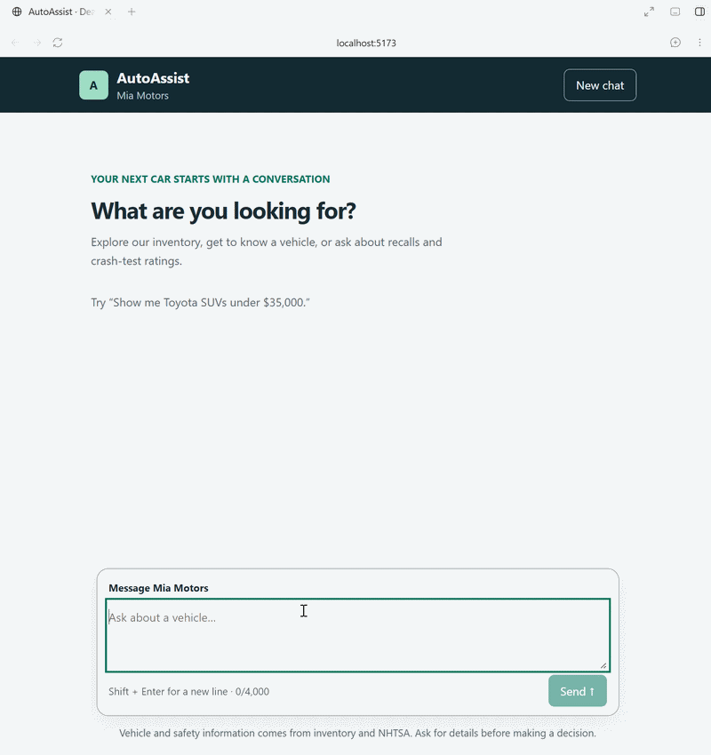

# AutoAssist



AutoAssist is an LLM-powered dealership chatbot. A
customer can search real dealership inventory in natural language, select a vehicle, ask contextual
follow-up questions, and retrieve NHTSA recall and crash-test information. The application exposes
that behavior through a durable HTTP API; the small React client above is a demonstration surface,
not the center of the design.

The backend is intentionally modest in infrastructure and strong in boundaries. FastAPI handles
transport, ordinary Python services own business rules, SQLAlchemy owns relational persistence,
Pydantic AI coordinates model tool use, and a narrow HTTPX adapter owns NHTSA traffic. Conversations,
request outcomes, model replay units, and vehicle selection live in PostgreSQL, so process restarts
do not erase context or cause completed requests to run twice. Database constraints and row locks
coordinate multiple backend workers without holding a transaction across model or NHTSA waits.

## Technology choices

| Technology | Role | Why it fits this prototype |
| --- | --- | --- |
| Python 3.13 | Backend runtime | Clear domain code, mature API/data tooling, and a good fit for a focused system that must remain easy to explain. |
| FastAPI + Uvicorn | HTTP API and application lifecycle | Typed request validation and OpenAPI come from the same schemas used by the running app. Lifespan provides one explicit place to construct and close database and network resources. |
| Pydantic v2 + pydantic-settings | API contracts and configuration | Strict validation keeps malformed requests and configuration out of the application core. Secrets are referenced by environment-variable name, not stored in source or the database. |
| SQLAlchemy 2 + PostgreSQL | Relational persistence and worker coordination | PostgreSQL provides durable shared state, portable constraints, row-level locking, and independent connection pools for multiple workers. SQLite provides fast isolated test fixtures. |
| Pydantic AI | LLM orchestration | Typed tools, structured output validation, repair requests, and model-history support let the model choose intent while the application retains control of facts and state. |
| OpenAI Responses API | Default model integration | The checked-in default uses a native tool-capable model connection. Gemini and xAI adapters demonstrate that provider choice remains server-owned configuration. |
| HTTPX | NHTSA integration | Async streaming responses, granular timeouts, connection pooling, and deterministic mock transports make the external boundary both bounded and testable. |
| pytest, Ruff, and mypy | Backend verification | Tests exercise temporary SQLite files plus a real isolated PostgreSQL coordination test and fake only external model/NHTSA services. |
| Docker Compose + uv | Reproducible execution | Locked Python dependencies, a non-root runtime image, two backend workers, and a named PostgreSQL volume make setup and restart behavior repeatable. |
| React + assistant-ui | Thin demo client | It makes the API easy to show while leaving conversation authority, validation, and persistence in the backend. |

## How the backend is organized

The code follows the direction of one request instead of organizing everything around a framework:

```text
HTTP routes and schemas
    ↓
Conversation / inventory application services
    ↓
Repositories and short SQLAlchemy transaction units
    ↓
PostgreSQL

Conversation service
    ↓
Pydantic AI runner → typed inventory and safety tools
                         ↓
                  Inventory service / NHTSA client
```

The important modules are:

- `backend/src/autoassist/app.py` — composition root and lifespan ownership. It loads configuration,
  creates the engine and external clients, constructs named model runners, recovers interrupted
  work, and closes everything on shutdown. Importing the module performs no I/O.
- `backend/src/autoassist/api/` — HTTP validation, response schemas, status codes, and translation
  between application records and public JSON. Routes do not contain SQL or model prompts.
- `backend/src/autoassist/inventory/` — CSV parsing/import, combined inventory filtering, detail
  lookup, and immutable records. The importer and web API share storage rules without sharing a
  long-lived session.
- `backend/src/autoassist/conversations/` — request admission, idempotency, persistence, paging,
  completion, failure settlement, cancellation, and startup recovery.
- `backend/src/autoassist/chat/` — provider adapters, bounded model execution, typed tool wrappers,
  structured answers, evidence validation, deterministic rendering, context selection, and budgets.
- `backend/src/autoassist/integrations/nhtsa.py` and `backend/src/autoassist/safety/` — bounded NHTSA
  HTTP calls, strict parsing, conservative vehicle matching, variant clarification, and presentation.
- `backend/src/autoassist/db/` — SQLAlchemy models, engine/session construction, schema checks, and
  dealership bootstrap.

For the fuller ownership map, see [`docs/architecture.md`](docs/architecture.md).

## Request lifecycle and durability

Every message submission includes a client-generated `request_id`. That ID is the durable identity
of one intentional attempt, not merely a tracing value.

1. The conversation service validates dealership and conversation scope.
2. A short transaction atomically inserts the request and user message and claims the conversation.
3. The transaction and session close before the backend waits on the model or NHTSA.
4. The model can call typed tools, but those tools receive the trusted dealership scope from the
   application. They cannot submit SQL or replace that scope.
5. The application validates the model's structured answer against evidence returned in this turn.
6. A deterministic renderer—not the model—writes inventory prices, specifications, recall facts,
   ratings, source links, and limitations into the public reply.
7. One completion transaction stores the assistant message, complete model/tool replay unit,
   selected vehicle, displayed choices, and exact terminal response before HTTP `200` is returned.

This produces useful failure semantics:

| Situation | Observable result |
| --- | --- |
| Same ID and text after completion | The exact stored status/body is replayed; the provider and NHTSA are not called again. |
| Same ID with different text | `409 request_id_conflict`; no message is appended. |
| Another request while the conversation is active | `409 conversation_busy`; the rejected request is not persisted as chat history. |
| Provider failure or timeout after admission | The user message remains, a sanitized terminal failure is stored, and no fictional assistant message is created. |
| Worker stops after admission but before completion | Other workers leave the fresh request alone. Once its 120-second age threshold expires, startup or the next submission marks it interrupted and releases the claim; external work is never silently rerun. |
| Completion committed but the response was lost | Retrying the same ID returns the stored success without duplicating messages. |

PostgreSQL is the source of truth for the transcript and model replay context. Failed and interrupted
user messages remain visible to the customer but are excluded from future model input. Public
history can grow and page independently; model context retains only bounded, complete turns so a
tool call is never separated from its result.

## Grounding instead of trusting generated facts

The LLM is useful for interpreting language and choosing tools, but it is not treated as a database.
Inventory tools accept typed filters and execute parameterized, dealership-scoped SQL. The model's
final structure contains intent, evidence IDs, requested fields, and selection actions—not arbitrary
prices or safety values.

The application then checks that every referenced vehicle or safety result came from current tool
evidence. Lists may use only the final search result set. Exact stock numbers and displayed ordinals
are resolved by application code. A successful detail response also retains that vehicle as the
conversation selection, allowing a later question such as “What are its recalls?” to work after a
restart.

This split keeps the probabilistic part narrow: the model can misunderstand a request and ask for
clarification, but it cannot make an invented price valid by putting it in fluent prose.

## NHTSA safety behavior

Recall and crash-rating lookups begin with the selected inventory record. The integration uses the
vehicle's year, make, model, body type, and drivetrain conservatively; it does not guess across a
known conflict. When NHTSA returns multiple compatible crash-test variants, AutoAssist presents up
to five choices and persists them so the customer can answer with an NHTSA ID after a restart.

Safety results retain their important distinctions:

- zero returned recalls is a verified empty result, not a network failure;
- unavailable data is labeled unavailable rather than presented as safe;
- crash categories can be available, partial, explicitly unrated, incomplete, ambiguous, absent,
  or unavailable;
- one safety branch can still be useful when the other branch fails;
- invalid star values never become zero-star ratings;
- source URLs and UTC retrieval/attempt times are rendered with the answer.

NHTSA responses are streamed and size-bounded. Per-request and cumulative deadlines, a three-GET
limit, record/variant caps, and evidence-size limits prevent an upstream service or model-directed
tool loop from creating unbounded work.

## Inventory import and query behavior

The source inventory is committed at
[`docs/context/inventory/data.csv`](docs/context/inventory/data.csv). A fresh database intentionally
contains no inventory until this file is imported while the server is stopped.

The parser validates the entire CSV before opening storage. One transaction then inserts new stock
IDs, updates changed records, leaves identical and absent records untouched, and preserves existing
vehicle UUIDs. A parse, lock, write, or commit failure leaves no partial batch. Re-running the same
file is the recovery procedure after an uncertain import outcome.

Inventory queries combine make, model, body type, year range, and price range with `AND`. Text filters
are trimmed and case-insensitive; ranges are inclusive. Filtering, ordering, cursor paging, and
limits happen in SQL. Every query requires a trusted dealership ID, including detail lookups.

## Run the project with Docker

Prerequisites are Docker Desktop and Docker Compose v2. Create a local `.env` from the example and
set the credential referenced by the default connection (`OPENAI_API_KEY` in the checked-in config).
No provider key is needed for health, inventory, or reading already stored terminal outcomes.

From the repository root:

```powershell
docker desktop start --detach --timeout 120
docker info
if (-not (Test-Path .env)) { Copy-Item .env.example .env }
docker compose build backend frontend
docker compose up -d database
docker compose stop backend
$inventoryCsv = (Resolve-Path docs/context/inventory/data.csv).Path
docker compose run --rm --no-deps -v "${inventoryCsv}:/tmp/inventory.csv:ro" backend autoassist-import-inventory --file /tmp/inventory.csv --dealership mia-motors --server-stopped
docker compose up -d backend frontend
python scripts/check-setup.py
```

Open the demo at [http://localhost:5173](http://localhost:5173), the API at
[http://localhost:8000](http://localhost:8000), and generated API documentation at
[http://localhost:8000/docs](http://localhost:8000/docs).

Stop normally without deleting data:

```powershell
docker compose down
```

The `autoassist-postgres` named volume contains PostgreSQL data. Ordinary backend, database-container,
or image recreation preserves it. The backend runs two Uvicorn workers against that shared store.

## Run the backend locally

Prerequisites are Python 3.13, uv 0.8.13, and the Compose PostgreSQL service. From the repository
root:

```powershell
uv sync --project backend --frozen
$env:OPENAI_API_KEY = "YOUR_LOCAL_KEY"
docker compose up -d database
uv run --project backend autoassist-import-inventory --file docs/context/inventory/data.csv --dealership mia-motors --server-stopped
uv run --project backend uvicorn autoassist.main:app --host 127.0.0.1 --port 8000 --workers 2
```

Local defaults use `config/dealerships.json` and PostgreSQL on `127.0.0.1:5432`. Override them with
`AUTOASSIST_CONFIG_FILE` and `AUTOASSIST_DATABASE_URL`. The example credentials are development-only.

## Walk through the HTTP API

The examples use PowerShell objects so JSON quoting stays readable. First discover the persisted
dealership UUID rather than hardcoding one:

```powershell
$dealerships = Invoke-RestMethod http://localhost:8000/dealerships
$dealership = $dealerships.items | Where-Object slug -eq "mia-motors"
$dealershipId = $dealership.id
```

Run a five-dimension combined query. Source row `AA-1001` is a 2022 Toyota RAV4 SUV priced
at `$26,335.00`.

```powershell
$vehicles = Invoke-RestMethod "http://localhost:8000/dealerships/$dealershipId/vehicles?make=Toyota&model=RAV4&body_type=SUV&year_min=2022&year_max=2022&price_min=26335.00&price_max=26335.00"
$vehicles.items
$vehicleId = $vehicles.items[0].id
Invoke-RestMethod "http://localhost:8000/dealerships/$dealershipId/vehicles/$vehicleId"
```

Create a conversation:

```powershell
$conversation = Invoke-RestMethod -Method Post `
  "http://localhost:8000/dealerships/$dealershipId/conversations" `
  -ContentType "application/json" -Body (@{} | ConvertTo-Json)
$conversationId = $conversation.id
$messagesUrl = "http://localhost:8000/dealerships/$dealershipId/conversations/$conversationId/messages"
```

Submit a natural-language inventory search. Keep the ID and exact text: they are the transport-retry
identity for this attempt.

```powershell
$searchId = [guid]::NewGuid().ToString()
$searchText = "Show me Toyota RAV4 SUVs from 2022 under 30000 dollars"
$searchBody = @{ request_id = $searchId; text = $searchText } | ConvertTo-Json
$searchReply = Invoke-RestMethod -Method Post $messagesUrl `
  -ContentType "application/json" -Body $searchBody
$searchReply.assistant_message.text
```

Use a new ID for each intentional follow-up:

```powershell
$selectReply = Invoke-RestMethod -Method Post $messagesUrl -ContentType "application/json" `
  -Body (@{ request_id = [guid]::NewGuid().ToString(); text = "Select stock AA-1001" } | ConvertTo-Json)

$detailReply = Invoke-RestMethod -Method Post $messagesUrl -ContentType "application/json" `
  -Body (@{ request_id = [guid]::NewGuid().ToString(); text = "What are its mileage and drivetrain?" } | ConvertTo-Json)

$safetyReply = Invoke-RestMethod -Method Post $messagesUrl -ContentType "application/json" `
  -Body (@{ request_id = [guid]::NewGuid().ToString(); text = "What recalls and crash-test ratings does it have?" } | ConvertTo-Json)
```

Read durable history in pages:

```powershell
$history = Invoke-RestMethod "$messagesUrl`?after_sequence=0&limit=50"
$history.items | Select-Object sequence, role, text, request_status, error_code
```

Retry the original search after a lost response by sending the same ID and exact text. The API
returns the stored terminal body and performs no new model or NHTSA work:

```powershell
$replayed = Invoke-RestMethod -Method Post $messagesUrl `
  -ContentType "application/json" -Body $searchBody
```

To demonstrate restart continuity, run `docker compose restart backend`, request history again, and
send a fresh follow-up such as `What is its price?`. The transcript and selected vehicle remain in
PostgreSQL.

### API surface

| Method and path | Purpose | Main outcomes |
| --- | --- | --- |
| `GET /health` | Local storage readiness | `200`, or sanitized storage `503` |
| `GET /dealerships` | Discover stable dealership IDs | `200`, `503` |
| `GET /dealerships/{id}/vehicles` | Combined filtered inventory search | `200`, `404`, `422`, `503` |
| `GET /dealerships/{id}/vehicles/{vehicle_id}` | Scoped vehicle details | `200`, `404`, `422`, `503` |
| `POST /dealerships/{id}/conversations` | Create and pin a connection identity | `201`, `404`, `503` |
| `POST /dealerships/{id}/conversations/{id}/messages` | Submit or replay one request | `200`, `404`, `409`, `422`, `500`, `502`, `503`, `504` |
| `GET /dealerships/{id}/conversations/{id}/messages` | Page authoritative public history | `200`, `404`, `422`, `503` |

## Configuration

[`config/dealerships.json`](config/dealerships.json) is server-owned. Each named connection contains
`provider`, `model`, and `api_key_env`; dealerships reference one default connection. Credential
values stay in the process environment and are never written to the database or returned by the
API.

Startup validates the whole file before database writes. A conversation pins its connection name,
provider, and model, so a configuration change cannot silently reroute existing history. Missing
credentials leave that connection unavailable for new work without breaking health, inventory,
history, or terminal replay. There is no automatic provider failover.

The default OpenAI client has a 30-second SDK timeout and disables SDK retries inside the shared
60-second turn deadline. Each turn is further bounded to six model requests, eight tool calls,
2,048 output tokens per model response, 16 KiB tool results, 64 KiB retained model history, 128 KiB
model request envelopes, and an 8,000-character public reply. Four conversations may run model work
at once per worker; the development container therefore permits up to eight active turns across its
two workers. There is no global queue or cross-instance admission cap.

## Verification

Run the focused backend checks from the repository root:

```powershell
uv run --project backend ruff check backend scripts
uv run --project backend ruff format --check backend scripts
uv run --project backend mypy backend/src
uv run --project backend pytest backend/tests -q
```

Most tests use real temporary, file-backed SQLite databases for speed. The shared Docker verifier
also runs isolated PostgreSQL tests for admission, terminal settlement, completion racing recovery
in both lock orders, concurrent schema/bootstrap startup, and abrupt worker termination with
fresh-request protection and stale recovery. Index-predicate validation and connection-failure
HTTP responses have regression coverage. Model and NHTSA fakes sit at external boundaries while real HTTP routes,
application services, repositories, transactions, grounding, rendering, and recovery behavior
execute. Coverage includes the complete source CSV import,
combined filters, dealership isolation, contextual selection, both safety branches, malformed and
unavailable upstream data, idempotent terminal replay, concurrency, cancellation, commit faults,
application recreation, and abrupt process termination.

For the locked Linux check image plus the small frontend demonstration checks:

```powershell
python scripts/verify.py
```

Optional live checks are deliberately separate from deterministic tests because provider and NHTSA
availability can change:

```powershell
docker compose -f compose.safety-live.yaml run --build --rm safety-live
```

## Database recreation after schema changes

This prototype deliberately has no migration framework. Ordinary startup creates missing tables
and preserves compatible data; it never resets inventory or conversations. Existing tables are
checked for required columns and indexes, including exact supported index predicates, before
bootstrap or recovery writes.

After a schema change, stop the backend and recreate only the intended development database. Back up
anything needed, run `docker compose down`, resolve the exact Compose volume with
`docker volume ls`, verify that it is this project's `autoassist-postgres` development volume, and
remove only that volume. Start `database`, then reimport the source CSV. Normal
`docker compose down` must not use `--volumes`.

## Deliberate limits

- Dealership IDs provide data routing and isolation, not authentication or production authorization.
- PostgreSQL coordinates multiple workers and permits multiple stateless backend instances, but
  the development Compose file exposes one two-worker backend. A production load balancer,
  authentication, database high availability, backups, and disaster recovery remain out of scope.
- NHTSA model-level data does not establish VIN-specific recall applicability, repair completion,
  or a safety guarantee. Inventory does not contain VINs or comparison weight.
- NHTSA data may be partial, unrated, stale, unavailable, or ambiguous. There is no background
  refresh, cross-turn safety cache, bulk scan, or nearest-year guessing.
- Conversation creation itself is not idempotent. Message submission is idempotent by request ID.
- Interrupted model work is not automatically resumed. Fresh work has a 120-second protection
  window; stale work is marked interrupted on startup or the next submission. The admitted user
  message is retained and a deliberate new attempt needs a new request ID. This is an age-based
  recovery policy, not worker-liveness detection or a renewable lease. Hosts sharing the database
  need synchronized clocks; a stalled live request can exceed the threshold, and its late
  completion cannot overwrite an already settled outcome.
- Uncommitted provider output can be lost. Exactly-once external execution is not promised; durable
  terminal replay prevents completed application requests from being repeated.
- The UI is a localhost demonstration: no authentication, streaming, attachments, voice,
  edit/regenerate, multi-chat browser, or production hosting. Those omissions do not weaken the
  backend's persisted conversation contract.

## What I would discuss in a walkthrough

The most useful code-review path is:

1. Start at `app.py` to see explicit dependency and resource ownership.
2. Follow a message route into `ConversationService`, then through admission and completion in
   `ConversationStore`.
3. Inspect the SQLAlchemy constraints that enforce request identity and one active request.
4. Follow `PydanticChatRunner` through typed tools, evidence validation, and deterministic rendering.
5. Trace one NHTSA request through transport bounds, parsing, matching, and safety presentation.
6. Finish in the recovery and HTTP integration tests, including the real PostgreSQL cross-worker
   admission and terminal-write race.

That route shows the core design claim: the backend lets an LLM interpret conversation, but keeps
scope, facts, transactions, durable state, error meaning, and recovery under ordinary application
control.

AI-assisted development was used throughout the project. The resulting behavior is documented and
tested at the system boundaries rather than relying on generated-code volume as evidence of
correctness.
